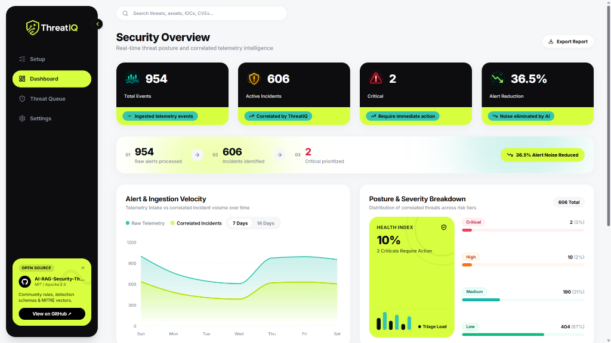
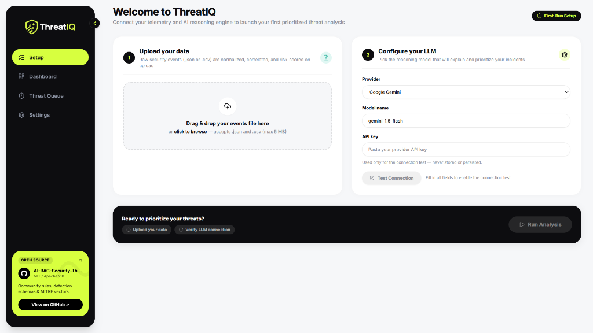
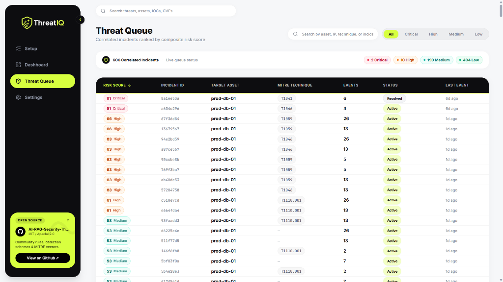
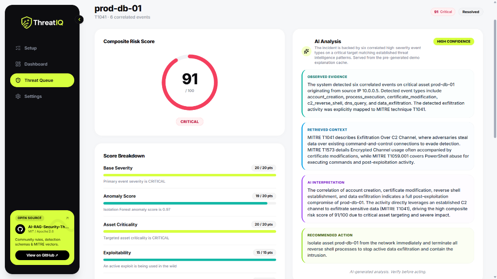
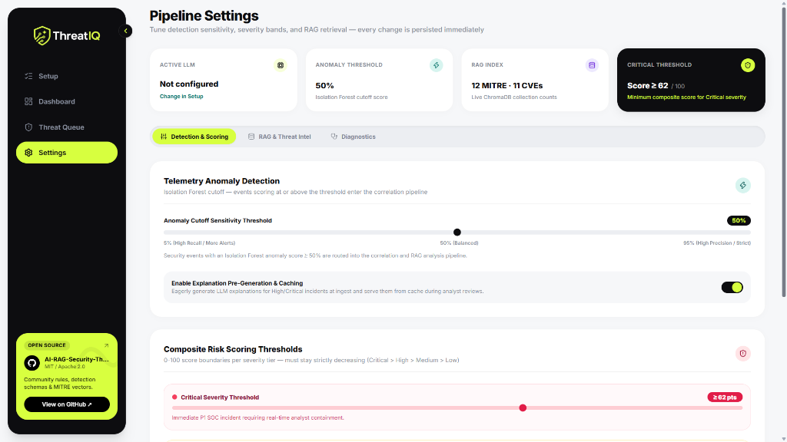

# ⚡ ThreatIQ — AI-Powered Security Threat Prioritizer Pro

<div align="center">

[](https://fastapi.tiangolo.com)
[](https://nextjs.org)
[](https://www.python.org)
[](https://www.typescriptlang.org)
[](https://www.trychroma.com)
[](https://scikit-learn.org)
[](https://opensource.org/licenses/MIT)

**Next-Generation Security Operations Intelligence: Unsupervised ML Anomaly Detection, Multi-Stage Attack Correlation, 7-Factor Composite Risk Scoring, and Hallucination-Resistant Retrieval-Augmented Generation (RAG).**

[Live Dashboard](#soc-analyst-dashboard-walkthrough) • [Key Capabilities](#core-capabilities) • [Architecture](#system-architecture) • [Getting Started](#getting-started) • [API Documentation](#rest-api-reference)

</div>

---

## 📌 Overview

Modern Security Operations Centers (SOCs) are overwhelmed by alert fatigue: tier-1 analysts wade through thousands of isolated alerts daily, with up to **80% false positives** and fragmented contextual data across disparate SIEM platforms.

**ThreatIQ** solves this fundamental bottleneck. It acts as an autonomous AI-driven triage layer that:
1. Ingests raw heterogeneous security telemetry (JSON, CSV, Syslog, SIEM events).
2. Runs high-speed **Isolation Forest ML** for behavioral anomaly detection.
3. Groups disparate events into cohesive multi-stage **attack chains** mapped directly to **MITRE ATT&CK®**.
4. Computes a transparent, multi-factor **Composite Risk Score (0–100)** incorporating asset criticality and active exploit intelligence.
5. Grounds generative AI reasoning using **ChromaDB Vector RAG** across curated CVEs, threat actor tactics, and containment playbooks.
6. Delivers explainable, evidence-backed findings and downloadable, audit-ready **Executive PDF reports**.

---

## 🖼️ SOC Analyst Dashboard Walkthrough

### 1. Executive Security Overview & Telemetry Velocity
Real-time posture monitoring displaying total ingested events, AI-correlated incidents, critical triage workload, noise reduction metrics, and 7-day/14-day alert velocity charts.

<div align="center">
  
</div>

> **SOC Insight**: Ingests 954 raw alerts, consolidates them into 606 correlated incidents, prioritizes the 2 critical emergencies, and eliminates **36.5% alert noise**.

---

### 2. First-Run Setup & Multi-Model LLM Configuration
Effortlessly upload telemetry data (`.json` or `.csv`) and configure your choice of LLM reasoning provider (**Google Gemini**, **OpenAI GPT-4o**, **Anthropic Claude**, **Groq**, or local **Ollama**) with instant connection testing.

<div align="center">
  
</div>

---

### 3. Correlated Threat Queue Ranked by Risk Score
Dynamic triage queue ranking correlated incidents by their composite risk score. Filter instantaneously across **Critical**, **High**, **Medium**, and **Low** severity bands, search by target asset, IP, or MITRE technique, and track live investigation statuses (**Active**, **Under Review**, **Contained**, **Resolved**).

<div align="center">
  
</div>

---

### 4. Deep-Dive Incident Triage & 4-Tier AI Reasoning
Comprehensive incident view featuring a radial composite risk score gauge, granular 7-factor mathematical score breakdown, and our structured, 4-tier hallucination-resistant AI explanation:
- **Observed Evidence**: Verifiable facts extracted directly from telemetry.
- **Retrieved Context**: Semantic matches from the ChromaDB vector database (MITRE ATT&CK techniques, CVEs).
- **AI Interpretation**: Attacker motivation, blast radius, and tactical stage analysis.
- **Recommended Action**: Concrete CLI, firewall, and host isolation remediation commands.

<div align="center">
  
</div>

---

### 5. Dynamic Pipeline Settings & Anomaly Sensitivity Tuning
Adjust the Isolation Forest anomaly cutoff threshold (5%–95%), calibrate custom score boundaries for Critical/High/Medium/Low tiers, inspect ChromaDB vector collection health, and toggle explanation pre-caching for near-zero analyst latency.

<div align="center">
  
</div>

---

## ⚡ Core Capabilities

| Feature | Description |
| :--- | :--- |
| **⚡ High-Throughput Anomaly Detection** | Sub-millisecond behavioral feature extraction and Scikit-Learn Isolation Forest scoring with persistent configurable cutoff thresholds. |
| **🔗 Attack-Chain Graph Correlation** | Temporal windowing and host/identity clustering that stitches related alerts across lateral movements into coherent multi-stage incidents. |
| **🎯 7-Factor Composite Risk Scoring** | Transparent, mathematically sound scoring formula ($0-100$) evaluating severity, anomaly confidence, asset criticality, exploitability, evidence volume, recency, and threat intel relevance. |
| **📚 Vector-Grounded Security RAG** | High-performance ChromaDB vector search indexing MITRE ATT&CK enterprise tactics, techniques, mitigations, and known exploited vulnerabilities (CVEs). |
| **🧠 Multi-Provider AI Reasoning** | Dynamic runtime support for Google Gemini Flash, OpenAI, Anthropic Claude, Groq LLaMA-3, and self-hosted Ollama with pre-generation caching. |
| **📑 Executive PDF Reporting Engine** | Automated ReportLab PDF generator compiling executive summaries, severity distributions, threat intel mappings, and containment playbooks. |
| **🛡️ Human-in-the-Loop Mitigations** | State machine tracking incident lifecycle transitions (`Active` $\to$ `Under Review` $\to$ `Contained` $\to$ `Resolved`) with audit logging. |
| **🎨 Modern Cyber SOC UI** | Cyberpunk-inspired dark/light theme, custom glassmorphic panels, animated risk gauges, and responsive data tables built with Next.js 14 & Tailwind CSS. |

---

## 🏗️ System Architecture

```
                                      ┌──────────────────────────────────────┐
                                      │   Raw Security Telemetry / Events    │
                                      │       (JSON, CSV, Syslog, EDR)       │
                                      └──────────────────┬───────────────────┘
                                                         │
                                                         ▼
                                      ┌──────────────────────────────────────┐
                                      │       Ingestion & Normalizer         │
                                      │ (Timestamp, IP, Host, Action parsing)│
                                      └──────────────────┬───────────────────┘
                                                         │
                                                         ▼
                                      ┌──────────────────────────────────────┐
                                      │    Fast-Path Anomaly Detector        │
                                      │   (Isolation Forest ML Model)        │
                                      └──────────────────┬───────────────────┘
                                                         │ Anomaly Score (0.0 - 1.0)
                                                         ▼
                                      ┌──────────────────────────────────────┐
                                      │      Attack-Chain Correlator         │
                                      │(Time Window & MITRE Graph Clustering)│
                                      └──────────────────┬───────────────────┘
                                                         │
                                                         ▼
                                      ┌──────────────────────────────────────┐
                                      │     Composite Risk Scoring Engine    │
                                      │      (0 - 100 Multi-Factor Score)    │
                                      └─────────┬──────────────────┬─────────┘
                                                │                  │
                         High / Critical Filter │                  │ Low / Medium
                                                ▼                  ▼
┌────────────────────────────────────────────────────────┐  ┌──────────────────┐
│              RAG Knowledge Retriever                  │  │ SQLite Database  │
│   (ChromaDB Vector Store: MITRE TTPs + CVE Catalog)    │  │ (Direct Storage) │
└───────────────────────┬────────────────────────────────┘  └──────────────────┘
                        │ Semantically Matched Context
                        ▼
┌────────────────────────────────────────────────────────┐
│               LLM Reasoning Layer                      │
│   (Google Gemini / Claude / GPT / Groq / Ollama)       │
│  Outputs: Evidence, Context, Interpretation, Action    │
└───────────────────────┬────────────────────────────────┘
                        │
                        ▼
┌────────────────────────────────────────────────────────┐
│           Presentation & Consumption Layer             │
│  ├─ Next.js 14 SOC Analyst Dashboard                   │
│  ├─ Audit-Ready Executive PDF Report Generator         │
│  └─ RESTful API (FastAPI OpenAPI/Swagger)              │
└────────────────────────────────────────────────────────┘
```

---

## 📐 Composite Risk Scoring Methodology

ThreatIQ avoids opaque "black-box" scoring. Each incident's Composite Risk Score ($0-100$) is computed across seven transparent, explainable factors:

$$\text{Total Score} = \sum_{i=1}^{7} \text{Factor Points}_i$$

| Factor | Max Points | Weighting Rationale |
| :--- | :---: | :--- |
| **Base Severity** | **20 pts** | Derived from primary alert classification (Critical: 20, High: 15, Medium: 10, Low: 5). |
| **Anomaly Score** | **20 pts** | Isolation Forest output scaled linearly ($Score \times 20$). |
| **Asset Criticality** | **20 pts** | Crown jewel weighting (e.g., Domain Controllers & Production Databases: 20 pts, User Workstations: 5 pts). |
| **Exploitability** | **15 pts** | Active CISA KEV / public weaponized exploit (+15 pts), known PoC (+10 pts). |
| **Evidence Count** | **10 pts** | Number of correlated events confirming multi-stage persistence ($min(count \times 2.5, 10)$). |
| **Recency** | **10 pts** | Time-decay factor rewarding rapid intervention on recent active intrusions. |
| **Threat Intel Relevance**| **5 pts** | Direct correlation with known APT campaigns or high-priority threat feeds. |

---

## 🗂️ Repository Structure

```
AI-RAG-Security-Threat-Prioritizer-Pro/
├── backend/
│   ├── api/                     # FastAPI endpoint routers
│   │   ├── incidents.py         # Incident list, detail, and lifecycle actions
│   │   ├── ingest.py            # Event batch ingestion & fast-path processing
│   │   ├── llm_config.py        # Multi-provider model configuration & test API
│   │   ├── reports.py           # Executive PDF report generation endpoint
│   │   ├── settings.py          # Dynamic pipeline & scoring thresholds
│   │   ├── stats.py             # Dashboard KPIs and alert velocity metrics
│   │   └── upload.py            # Telemetry file parser (JSON / CSV)
│   ├── correlation/             # Temporal & graph-based event correlator
│   ├── database/                # SQLAlchemy ORM models, session & migrations
│   ├── demo_data/               # Static telemetry and pre-cached explanations
│   ├── detection/               # Behavioral feature extraction & Isolation Forest
│   ├── llm/                     # Provider adapters (Gemini, Claude, GPT, Ollama)
│   ├── mitigation/              # Analyst action state machine
│   ├── models/                  # Pydantic schemas (events, incidents, metrics)
│   ├── models_config/           # Settings & configuration data models
│   ├── rag/                     # ChromaDB vector store & knowledge retriever
│   ├── reports/                 # ReportLab PDF design and canvas builder
│   ├── scoring/                 # 7-factor composite risk calculator
│   ├── tests/                   # Test suite (anomaly, database, scoring, e2e)
│   ├── main.py                  # FastAPI application entrypoint
│   └── requirements.txt         # Backend Python dependencies
├── frontend/
│   ├── app/                     # Next.js 14 App Router
│   │   ├── page.tsx             # Executive Security Overview Dashboard
│   │   ├── setup/               # Telemetry upload & LLM provider setup
│   │   ├── threats/             # Correlated Threat Queue & Incident Deep Dive
│   │   ├── settings/            # Pipeline sensitivity & threshold controls
│   │   └── layout.tsx           # Dashboard root shell with cyber navigation
│   ├── components/              # Modular UI components (charts, cards, queue)
│   ├── lib/                     # API client, TypeScript definitions & utils
│   ├── public/                  # Static assets & ThreatIQ brand logos
│   └── tailwind.config.ts       # Design system tokens and styling rules
├── docs/
│   └── screenshots/             # Production UI screenshots
├── scripts/                     # Verification, demo seeding, and setup scripts
├── .gitignore                   # Security exclusions (keys, venv, databases)
└── README.md                    # Project documentation
```

---

## 🚀 Getting Started

### Prerequisites

- **Python**: 3.11 or higher
- **Node.js**: 18.x or higher & npm
- **API Key** *(Optional)*: Google Gemini, OpenAI, or Anthropic API key (ThreatIQ includes pre-generated demo intelligence out of the box).

---

### Backend Setup

1. **Clone the repository**:
   ```bash
   git clone https://github.com/talaaltariq/AI-RAG-Security-Threat-Prioritizer-V2.git
   cd AI-RAG-Security-Threat-Prioritizer-V2
   ```

2. **Create and activate a Python virtual environment**:
   ```bash
   # Linux / macOS
   python3 -m venv venv
   source venv/bin/activate

   # Windows
   python -m venv venv
   .\venv\Scripts\activate
   ```

3. **Install dependencies**:
   ```bash
   pip install -r backend/requirements.txt
   ```

4. **Initialize Knowledge Base & Demo Database**:
   ```bash
   python scripts/build_knowledge_base.py
   python scripts/reset_demo_db.py
   ```

5. **Start the FastAPI server**:
   ```bash
   uvicorn backend.main:app --host 0.0.0.0 --port 8000 --reload
   ```
   The backend API will be available at `http://localhost:8000`. Interactive OpenAPI documentation is accessible at `http://localhost:8000/docs`.

---

### Frontend Setup

1. **Navigate to the frontend directory**:
   ```bash
   cd frontend
   ```

2. **Install Node dependencies**:
   ```bash
   npm install
   ```

3. **Configure environment variables**:
   Create a `.env.local` file:
   ```env
   NEXT_PUBLIC_API_URL=http://localhost:8000
   ```

4. **Start the Next.js development server**:
   ```bash
   npm run dev
   ```
   Open `http://localhost:3000` in your browser.

---

## 🧪 Verification & Automated Tests

Run the backend verification suite to validate all pipeline stages:

```bash
# Verify Pipeline Settings & Score Boundaries
python scripts/verify_pipeline_settings.py

# Verify Multi-Model LLM Configuration
python scripts/verify_llm_config.py

# Verify ChromaDB RAG Vector Store
python scripts/verify_rag_settings.py

# Execute Python Test Suite
pytest backend/tests -v
```

To build and validate the frontend production bundle:

```bash
cd frontend
npm run build
```

---

## 🔌 REST API Reference

| Method | Endpoint | Description |
| :--- | :--- | :--- |
| `GET` | `/api/stats` | Retrieves top-level KPI metrics and alert velocity breakdown. |
| `GET` | `/api/incidents` | Fetches filtered, prioritized incidents with risk scores. |
| `GET` | `/api/incidents/{id}` | Detailed incident analysis with RAG context & LLM explanation. |
| `POST` | `/api/incidents/{id}/action`| Updates incident lifecycle status (`contain`, `resolve`, etc.). |
| `POST` | `/api/ingest` | Ingests a raw security event batch for immediate triage. |
| `POST` | `/api/upload` | Uploads and normalizes `.json` or `.csv` event log files. |
| `GET` | `/api/settings` | Fetches active pipeline knobs and risk scoring thresholds. |
| `PUT` | `/api/settings` | Updates anomaly cutoff and custom severity score boundaries. |
| `GET` | `/api/llm/config` | Retrieves current LLM provider and model selection. |
| `POST` | `/api/llm/test` | Verifies live API key connectivity to the configured LLM provider. |
| `GET` | `/api/reports/incident/{id}/pdf` | Generates and streams an audit-ready executive PDF report. |

---

## 🛡️ Attack Scenario: "Operation Shadow DB"

ThreatIQ includes a complete multi-stage Advanced Persistent Threat (APT) simulation:

```
[Phase 1: Recon] ────────► Internal port scan detected on production database (prod-db-01)
[Phase 2: Access] ───────► High-volume credential stuffing against administrative accounts
[Phase 3: Pivot] ────────► Off-hours lateral movement using harvested credentials
[Phase 4: C2 & Staging] ─► Reverse shell established (MITRE T1059 / T1573)
[Phase 5: Exfiltration] ─► Outbound encrypted data exfiltration over C2 channel (MITRE T1041)
```

The correlation engine automatically clusters these individual events into a unified incident, flags the anomaly, weights target asset criticality (`prod-db-01` = CRITICAL), retrieves matching MITRE intelligence, and generates a **91/100 Composite Risk Score** with concrete containment steps.

---

## 📜 License

This project is licensed under the **MIT License**. See the [LICENSE](LICENSE) file for details.

<div align="center">
Built with precision for security teams protecting mission-critical infrastructure.
</div>
